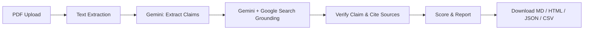

# FactChecker AI

A production-ready **Streamlit** web app that extracts factual claims from PDF documents, verifies them against live web data using **Google Gemini** with **Google Search grounding**, and generates downloadable verification reports with trust and source credibility scores.


---

## Features

- **PDF Upload** — Extract text from uploaded PDF documents (up to 50 pages)
- **Claim Extraction** — Gemini identifies statistics, percentages, dates, financial figures, and verifiable statements
- **Live Verification** — Gemini Google Search grounding retrieves current web evidence for each claim
- **Structured Results** — For every claim:
  - Claim text
  - Status (`Verified`, `Inaccurate`, `False`)
  - Confidence score (0–100)
  - Correct fact
  - Source URLs with credibility breakdown
- **Trust Score (0–100)** — Weighted score combining verification status, confidence, and source quality
- **Source Credibility Score** — Domain-based scoring:
  | Source Type     | Score |
  |-----------------|-------|
  | Government      | 100   |
  | Research Paper  | 90    |
  | Major News      | 75    |
  | Blog            | 50    |
- **Downloadable Reports** — Export as Markdown, HTML, JSON, or CSV
- **Modern SaaS UI** — Clean gradient hero, metric cards, and responsive layout

---

## Screenshots

> Add your own screenshots after running the app locally. Place PNG files in `assets/screenshots/` and they will render below.

### Dashboard & Upload


*Drag-and-drop PDF upload with hero banner and sidebar configuration guide.*

### Analysis Summary


*Trust score, source credibility, and claim status breakdown after analysis completes.*

### Claim Results


*Per-claim verification cards showing status badges, correct facts, and cited sources.*

### Download Report


*One-click export in Markdown, HTML, JSON, and CSV formats.*

#### Capturing Screenshots

```bash
streamlit run app.py
# Open http://localhost:8501
# Take screenshots and save to assets/screenshots/
```

Recommended filenames: `upload.png`, `summary.png`, `claims.png`, `download.png`

---

## Project Structure

```
fact-checker/
├── app.py                      # Streamlit entry point
├── requirements.txt            # Python dependencies
├── README.md
├── .env.example                # Local environment template
├── .gitignore
├── .streamlit/
│   └── config.toml             # Theme & server settings
├── assets/
│   └── screenshots/            # README screenshot assets
└── src/
    ├── __init__.py
    ├── config.py               # Settings & secrets loading
    ├── pdf_extractor.py        # PDF text extraction
    ├── gemini_client.py        # Claim extraction & Google Search verification
    ├── credibility.py          # Source credibility scoring
    ├── fact_checker.py         # Pipeline orchestration
    └── report_generator.py     # Report export (MD/HTML/JSON/CSV)
```

---

## Quick Start (Local)

### 1. Clone & install

```bash
git clone <your-repo-url>
cd fact-checker
python -m venv .venv

# Windows
.venv\Scripts\activate

# macOS / Linux
source .venv/bin/activate

pip install -r requirements.txt
```

### 2. Configure API keys

Copy the example env file and add your keys:

```bash
cp .env.example .env
```

| Key | Where to get it |
|-----|-----------------|
| `GEMINI_API_KEY` | [Google AI Studio](https://aistudio.google.com/apikey) |

### 3. Run the app

```bash
streamlit run app.py
```

Open **http://localhost:8501** in your browser.

---

## Deploy to Streamlit Cloud

1. Push this repository to GitHub.
2. Go to [share.streamlit.io](https://share.streamlit.io) and connect your repo.
3. Set **Main file path** to `app.py`.
4. Add secrets in **App settings → Secrets**:

```toml
GEMINI_API_KEY = "your_gemini_api_key"
```

5. Click **Deploy**.

Streamlit Cloud automatically installs dependencies from `requirements.txt`.

---

## How It Works



1. **Extract** — `pypdf` pulls text from the uploaded PDF.
2. **Identify** — Gemini returns structured JSON with verifiable claims.
3. **Search & Verify** — One Gemini call with Google Search grounding verifies all claims in a single batch.
4. **Cite** — Grounding metadata provides source URLs for each verdict.
5. **Score** — Trust and source credibility scores are computed.
6. **Export** — Results are available in the UI and as downloadable reports.

---

## Configuration

| Variable | Default | Description |
|----------|---------|-------------|
| `GEMINI_API_KEY` | — | Google Gemini API key (required) |
| `GEMINI_MODEL` | `gemini-2.5-flash` | Gemini model name (must support Google Search grounding) |
| `MAX_PDF_PAGES` | `50` | Maximum PDF pages to analyze |
| `MAX_CLAIMS` | `3` | Maximum claims per document (hard cap; 2 Gemini API calls total) |

---

## Trust Score Formula

Each claim contributes a weighted score based on:

- **Status weight** — Verified (1.0), Inaccurate (0.45), False (0.0)
- **Confidence** — Gemini confidence score (0–100)
- **Source credibility** — Average domain score for cited URLs

The final **Trust Score** is the average across all claims, scaled to 0–100.

---

## Limitations

- Works best with **text-based PDFs**; scanned/image PDFs require OCR (not included).
- Verification quality depends on web search results and model reasoning.
- API usage incurs costs on Gemini (including Google Search grounding) according to your plan.
- Not a substitute for professional human fact-checking.

---

## License

MIT License — use freely for personal and commercial projects.
